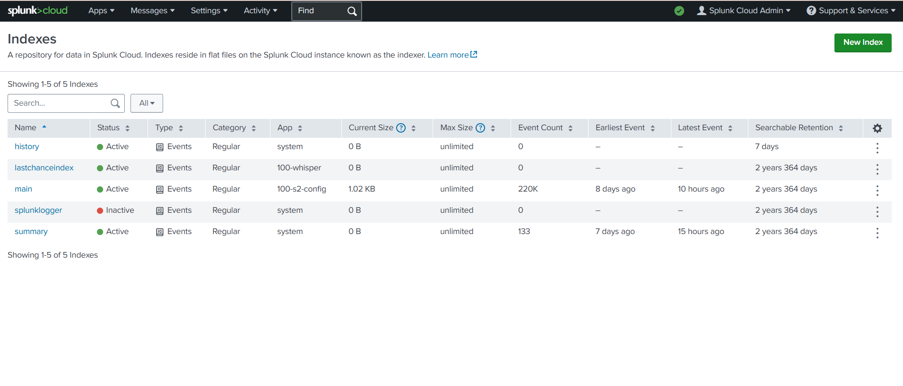
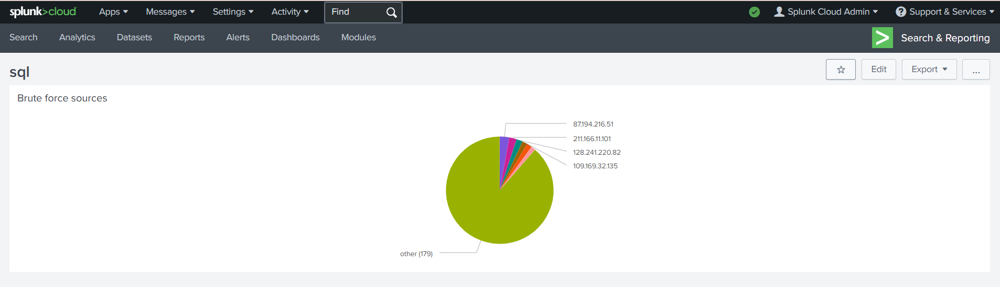
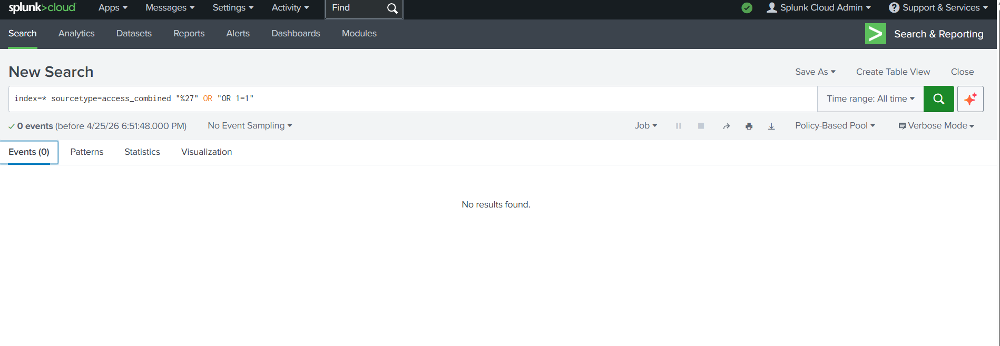
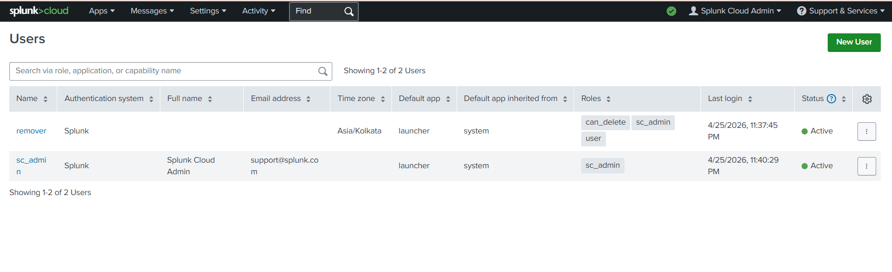

 🛡️ Splunk SOC Analysis: Threat Hunting & Data Governance

Project by: Nayana B C

Project Overview
 This project demonstrates a fully functional Security Operations Center (SOC) environment built in *Splunk Cloud*. Using the "Buttercup Games" dataset, I performed end-to-end security operations, from raw log ingestion to high-level threat visualization.

Technical Skillset
* *SIEM Platform:* Splunk Cloud
* *Threat Hunting:* Identifying SQL Injection signatures and SSH Brute Force patterns.
* *Data Engineering:* Regex extraction (rex), indexing, and field mapping.
* *Identity & Access Management (IAM):* Implementing the Principle of Least Privilege.

 Lab Execution Phases

 1. Data Ingestion & Lifecycle Proof
Verified successful ingestion of ~110,000 events into the Splunk index. This phase confirmed data integrity and proper storage management.

 2. Brute Force Detection & Visualization
Using SPL (Search Processing Language), I identified a high volume of failed login attempts. I developed a dashboard to visualize the top attacker IP addresses (e.g., 194.8.74.23).

 3. Proactive Threat Hunting (SQL Injection)
I conducted a hunt for URL-encoded attack signatures such as %27 (single quote) and logical bypasses (OR 1=1) within web access logs.

 4. Security Governance & Audit
To maintain environment hygiene, I created a dedicated remover account with can_delete capabilities. This mirrors professional SOC workflows by separating administrative duties from destructive actions.

 Conclusion
 It demonstrates my ability to navigate complex Cloud SIEM environments and extract actionable security intelligence.
