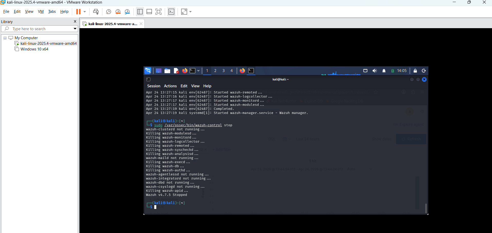
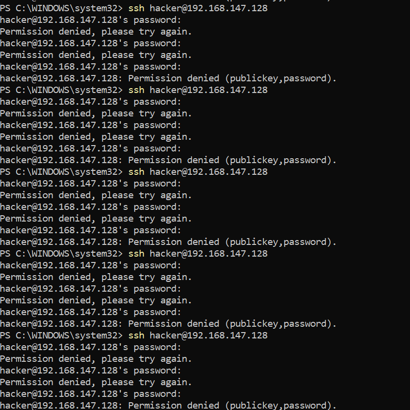

🛡️Soc Lab : End-to-End SSH Brute Force Detection & Analysis

Lab Objective
 To build a complete security pipeline that captures, forwards, and analyzes brute force authentication attacks from a Windows host to a Linux target.

Technical Environment
 *Victim Machine: Kali Linux v2025.4 (VMware)
 *Attacker Machine: Windows 10 Host (PowerShell)
 *Monitoring Tools: Wazuh Manager v4.7.5 
 *Protocols: SSH, Rsyslog (Port 514)

Implementation Steps
1. *Service Configuration: Installed and verified the *Wazuh Manager* service on Kali Linux to monitor system integrity.
2. *Log Forwarding: Configured *rsyslog* on the Kali VM to forward auth logs to the SIEM.
3. *Network Bridging: Configured VMware networking to allow communication between the Windows Host and the Kali Guest.
4. *The Attack: Simulated a brute force credential attack using a PowerShell script targeting the Kali SSH port (22).
5. *Detection: Analyzed the generated "Failed password" events in Splunk and monitored service status via Wazuh.

 Lab Evidence
### 1. Wazuh Manager Status

Managing the Wazuh manager service during the detection phase.

### 2. Attack Execution

Logs from the Windows host showing the high-frequency login attempts.

### 3. Splunk Visualization

Final SOC dashboard showing the attacker's IP and total failed attempt count.

## Conclusion
This lab demonstrates how to bridge Windows and Linux environments for security monitoring. It highlights the importance of centralizing logs via rsyslog to ensure that even if a local log is cleared, the SOC team has a record in the SIEM.
