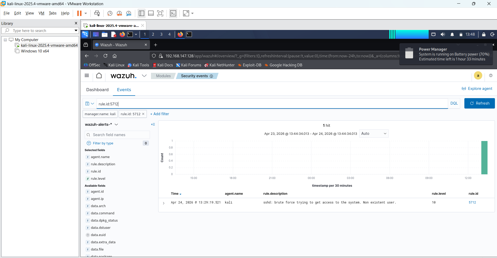

 🛡️ Soc Lab :  SSH Brute Force Detection

## Lab Objective
To build a functional SOC environment that captures a cross-platform attack. This lab demonstrates the integration of Linux logging, rsyslog forwarding, and Wazuh XDR analysis.

##  Technical Stack & Configuration
* *Attacker:* Windows 10 Host (Attacking via *PowerShell*).
* *Victim:* Kali Linux v2025.4 (Running in *VMware Workstation*).
* *Networking:* Configured *Bridged Networking* to allow cross-OS communication.
* *Log Pipeline:* rsyslog configured to monitor and forward /var/log/auth.log.
* *SIEM/XDR:* *Wazuh Manager & Dashboard* v4.7.5.

##  Lab Execution Phases
1. *Infrastructure Setup:* Configured *VMware Bridged Adapter* and verified connectivity between Windows (Attacker) and Kali (Victim).
2. *Log Centralization:* Enabled and configured *rsyslog* on Kali Linux to ensure all authentication events were captured.
3. *Wazuh Service Management:* Used the terminal to start and verify the wazuh-manager service to ensure the ruleset (Rule 5712) was active.
4. *The Attack:* Executed a persistent SSH brute force attack from the *Windows PowerShell* terminal targeting the Kali IP.
5. *Detection & Visualization:* Observed the real-time alert generation in the *Wazuh Dashboard*, successfully identifying the malicious IP and the "sshd: brute force" pattern.

##  Lab Evidence

### 1. Attack Execution (Windows PowerShell)

Evidence of the brute force script running from the host machine.

### 2. Backend Management (Wazuh & Rsyslog)

Terminal status showing the Wazuh and rsyslog services running on the Kali target.

### 3. XDR Alert (Wazuh Dashboard)

The final alert: Rule 5712 triggering a high-level security event for the detected attack.

##  Conclusion
This lab highlights the importance of *log visibility*. By configuring rsyslog and a bridged network, I successfully created a pipeline that moved raw attack data from a Linux endpoint to a Wazuh XDR dashboard for immediate SOC analysis.
