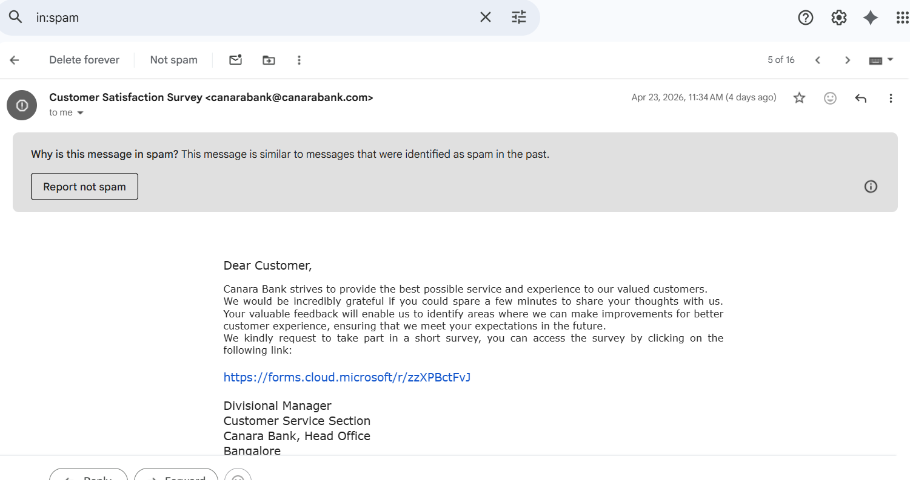
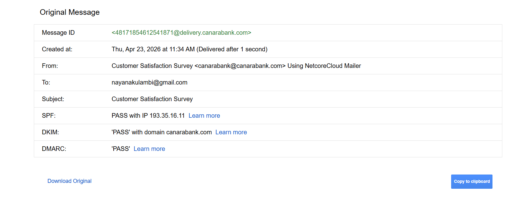
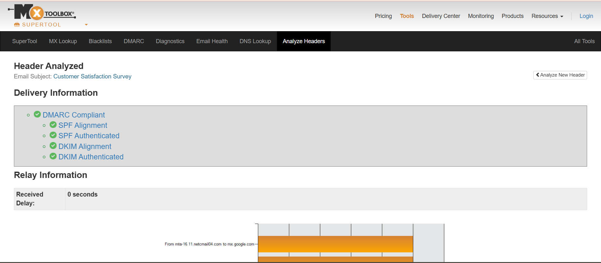
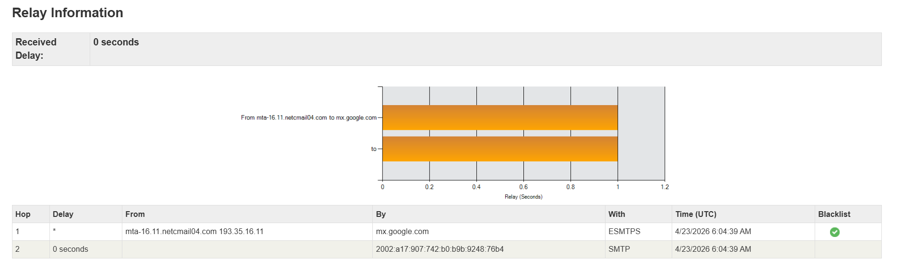
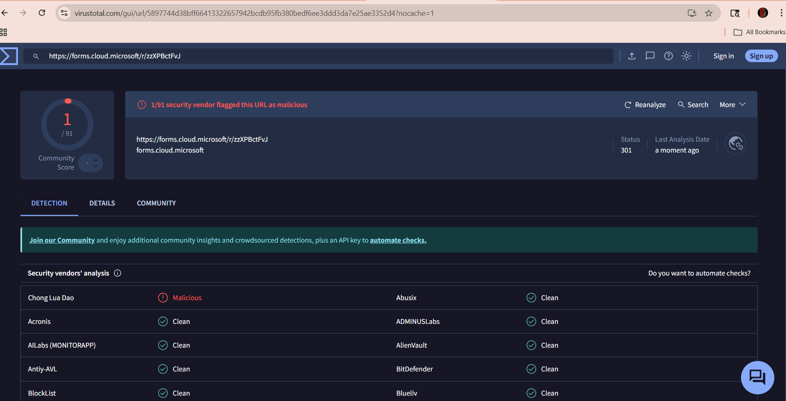

🛡️Soc Lab : Phishing Investigation & NIST Incident Response Workflow

 #  Lab Objective
To perform an end-to-end technical triage of a suspected phishing email. This lab demonstrates how to move beyond visual cues into *SMTP Header Analysis, **Relay Hop Tracing, and **Threat Intelligence Enrichment* to confirm a malicious threat and execute a professional response.

 #  Technical Stack & Tools
* *Analysis:* MX Toolbox (SMTP Header breakdown).
* *Threat Intel:* VirusTotal (URL Sandbox & Reputation check).
* *Framework:* NIST SP 800-61 (Incident Response Lifecycle).
* *Key Protocols:* SPF, DKIM, DMARC, SMTP Hops.

##  Phase 1: Detection & Deep Analysis

### 1. Initial Triage (Visual Inspection)
* *Observation:* The email claims to be a "Customer Satisfaction Survey" from Canara Bank [Oberve Sender address, Subject line, Email.body & links,attachmenta].
* *Red Flag:* The call-to-action is a *Microsoft Forms link* (forms.cloud.microsoft.com).
* *Analyst Note:* Professional financial institutions rarely use public cloud-based forms for customer data collection due to compliance and security risks.

### 2. Authentication Theory: The "DMARC Pass" Trap
A common misconception is that if an email passes SPF, DKIM, and DMARC, it is safe.
* *The Reality:* Attackers often use legitimate third-party bulk-mailing services (like NetcoreCloud). Because the attacker owns the "mailing domain," the technical protocols (*SPF/DKIM/DMARC) all return a **PASS*.
* *Conclusion:* Authentication only proves who sent the email; it does not prove the intent of the content.

### 3. Relay Hop Analysis
Every email travels through multiple mail servers, known as *Hops*. By analyzing these:
* *Trace Result:* The investigation showed the email originated from IP 193.35.16.11.
* *Significance:* Tracing the hops confirmed the email bypassed standard organizational filters by utilizing a professional marketing relay. This "Relay Hop" analysis helps a SOC analyst distinguish between a direct spoofing attempt and a campaign-based attack.

### 4. URL Enrichment (VirusTotal)
* *Action:* The suspicious URL was extracted and scanned.
* *Result:* *1/91 Security Vendors* flagged the link as Malicious.
* *Verdict:* *TRUE POSITIVE*. The link is a Credential Harvesting attempt.

##  Phase 2: Incident Response (NIST Workflow)

Following the *NIST SP 800-61* standard, the following actions were simulated:

1.  *Preparation:* Ensuring MX Toolbox and VirusTotal were integrated into the analyst's workflow.
2.  *Detection & Analysis:* Performed header analysis to confirm the email was an "authenticated" phishing attempt.
3.  *Containment (STOP THE BLEEDING):*
    * Proposed blacklisting the malicious URL at the Web Proxy/DNS level.
    * Flagged the sender IP for monitoring in the SIEM.
4.  *Eradication (REMOVE THE THREAT):*
    * Executed a search-and-purge command to delete the phishing email from all employee inboxes.
5.  *Recovery:*
    * Checked Proxy logs for any outbound traffic to the Microsoft Forms URL.
    * Initiated password resets for any users who interacted with the link.
6.  *Lessons Learned:*
    * Updated the email security gateway to trigger higher scrutiny on public form links (Google/Microsoft Forms) originating from external financial campaign domains.

##  Lab Evidence

### 1. Phishing Detection & Header Summary

### 2. Authentication & Relay Hop Results

### 3. VirusTotal Threat Intelligence

##  Conclusion
This lab highlights that a *DMARC PASS* is not a green light for safety. A modern SOC Analyst must combine protocol verification with *Relay Hop Analysis* and *URL Reputation* to uncover sophisticated "Authenticated Phishing" campaigns. By following the *NIST IR Workflow*, we ensure that once a threat is found, it is contained and eradicated systematically.

##Advanced Analyst Insights: The "Authentication Paradox"

During this lab, I compared a legitimate personal email with the confirmed Phishing email to understand DMARC compliance nuances.

* *The Phishing Result (DMARC PASS):* Professional attackers often utilize legitimate third-party mailing services. Because they own the sending domain, they can configure perfect SPF/DKIM/DMARC records. This "Pass" status is used to bypass reputation filters and gain user trust.

* Comparison Evidence: Personal Email with DMARC Non-Compliance
  

* *The Personal Email Result (DMARC NON-COMPLIANT):* In contrast, a personal email often shows a *Red X* for DMARC compliance. This is usually because individual users or small private domains haven't published a formal DMARC policy in their DNS records.
* *Key Lesson:* A *DMARC PASS* is a technical verification of the sender's identity, but it is *not* a certificate of safety. A "Perfect" score on a suspicious banking email is actually a red flag indicating a professional, well-funded campaign.

  
